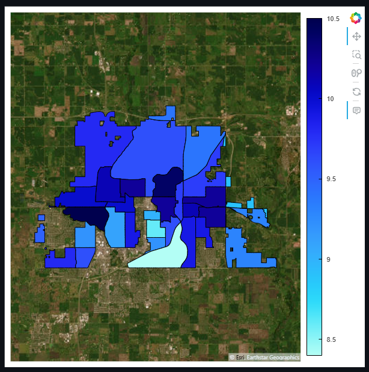
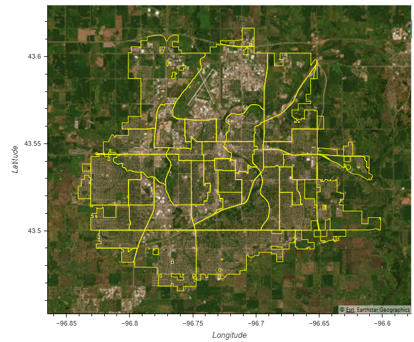

# Earth Data Science Portfolio: Urban Greenspace

## Overview
In this project, I aimed to analyze green space within the City of Sioux Falls at the census tract level by leveraging high-resolution satellite imagery. By aligning with the spatial resolution of human health data from the CDC, this analysis supports more precise investigations into potential relationships between urban vegetation and public health outcomes. While coarser satellite data can be used to understand the structure and distribution of green space within urban areas to provide finer details.

To achieve this, I will utilize 1-meter resolution imagery from the National Agricultural Imagery Program (NAIP), which captures detailed views sufficient to identify individual trees and vehicles. Although originally intended for agricultural monitoring, NAIP’s spatial resolution makes it especially valuable for studying complex urban environments.

### Site Description
The site map visualizes the City of Sioux Falls using modified census tracts from the CDC Places dataset, overlaid on high-resolution satellite imagery. The tracts have been clipped to the city boundary, ensuring alignment with public health data for spatial comparison. By filtering the dataset to include only tracts labeled "Sioux Falls," we ensure our analysis is both geographically and contextually relevant.

From the satellite imagery, we can see that greenspaces are unevenly distributed across the city. Larger parks and vegetated areas are mainly concentrated on the outskirts and in certain pockets of the western and southern regions. In contrast, the central urban areas appear more densely developed with sparse green space. The city’s layout reflects variations in land use and urban planning across different neighborhoods, highlighting spatial disparities in access to natural environments.

### Data Description 
Before fitting our linear regression model, we prepared the data to meet the assumptions required for Ordinary Least Squares (OLS) regression. This process included filtering, variable selection, and transformation steps to ensure statistical validity and model performance.

**Data Selection**
I began with a merged dataset containing greenness (NDVI) metrics and CDC Places health data for Chicago census tracts. To prepare the data for modeling:

Selected the following variables: frac_veg, asthma, mean_patch_size, edge_density, and geometry.

Applied .dropna() to eliminate rows with missing values. This step ensures that our model is trained on complete data, avoiding the introduction of bias or instability from NaNs.

**Variable Transformation**
Upon exploratory analysis using hvplot.scatter_matrix(), we observed that the asthma variable was right-skewed. Since OLS regression assumes normally distributed residuals, we applied a log transformation to asthma to reduce skew and approximate a normal distribution. This transformation helps stabilize variance and improve the linear relationship with predictor variables. 

**Interpretation of Variable Relationships**
The scatter matrix revealed moderate linear relationships between green space structure metrics and log_asthma. Edge_density appears inversely related to asthma prevalence, suggesting areas with more fragmented vegetation may correlate with lower health outcomes. Mean_patch_size may indicate the overall connectivity or isolation of green space, which could also influence environmental exposure.

